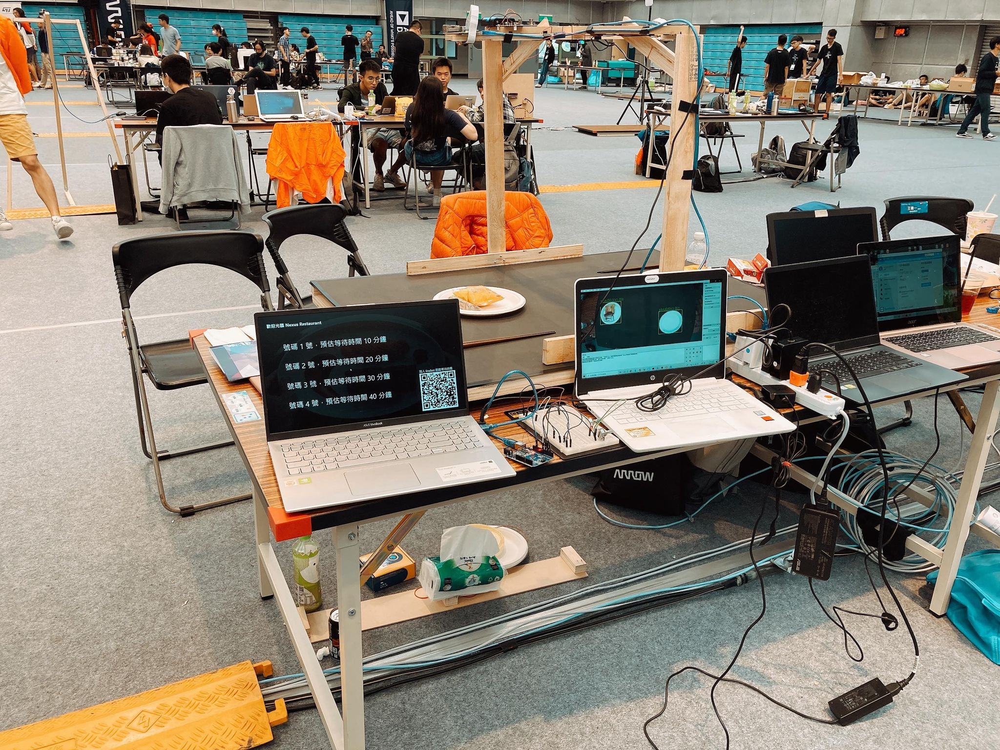

# MakeNTU2020
## 隊伍資訊
* 隊名：NCTU Nexus Attack
* 主題：用餐進度管控系統
* 得獎名稱：威盛科技企業獎
* [賽前討論與專案架構](https://hackmd.io/iQ_s2b-XS7-zYrXxzPZTXQ)
* 成品照

## 作品分析
### [主機 1](Computer1)
用來接收影像分析資訊以及計算並顯示出結果，使用 Python3 的 Flask 模組製作，其中包含
1. 給外場客人看的螢幕：讓客人知道還須要等多久，螢幕上會有客人號碼牌的等待時間，並且上面會有 linebot 的 QRCODE
2. 給廚師看的螢幕：讓廚師知道做菜的優先順序，螢幕上會顯示每一桌的用餐進度

### [給服務生看的 IOT](LED)：利用 Arduino 接 LED，提醒服務生收餐盤的時間

### [linebot](linebot)：讓客人能夠隨時隨地詢問 linebot 等待時間

### [威盛科技的產品](VIA)：利用威盛科技的產品 pixetto，偵測客人是否仍在享用餐點

### 樹梅派 1, 2
